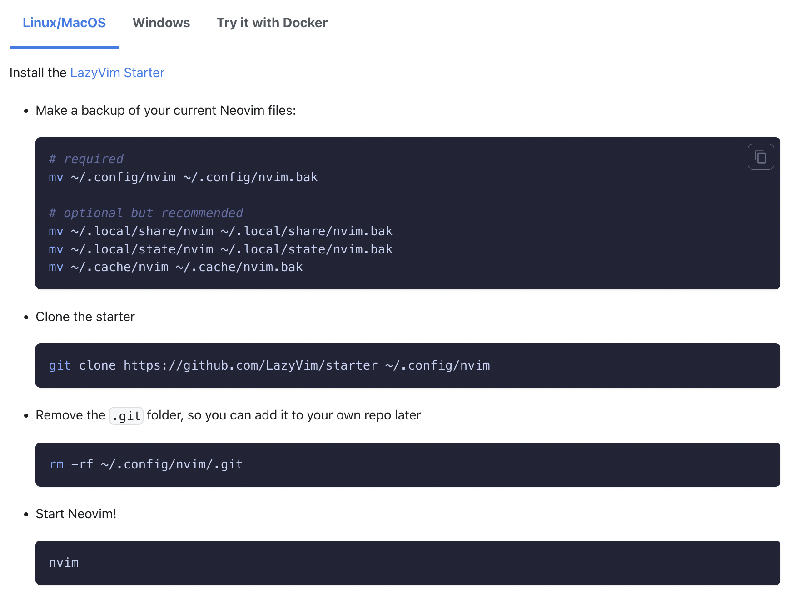

# neovim-tutorial

# Catalog

### Part 1: [Vim Shortcuts](#part-1-vim-shortcuts)

### Part 2: [Neovim Setup](#part-2-neovim)

### Part 3: [Neovim Language Server Protocol(LSP) Setup](#part-3-neovim-language-protocol-serverlsp-setup)

### Part 4: [VSCode Vim](#part-4-vscode-vim)

### Part 5: [Lazyvim](#part-5-lazyvim-1)

### Part 6: [Chatgpt](#part-6-chatgpt-1)

---

## Part 1: Vim Shortcuts

**Tutorial Video Links: [Youtube](https://www.youtube.com/watch?v=5nHdG0MdK1Y), [Bilibili](https://www.bilibili.com/video/BV1qD4y1W7aG/?spm_id_from=333.999.0.0&vd_source=a32bcb316a5f16efd4a398938b585caf)**

### Installation:

Open VScode, search `Vim` in `Extensions`, and click install.


<br>
<br>

In the following keymappings, `n` stands for `NORMAL` mode, `i` stands for `INSERT` mode, `v` stands for `VISUAL` mode.

### Open and Close Files

| Mode | Shortcut | Description                                               |
| ---- | -------- | --------------------------------------------------------- |
| `n`  | `:w`     | Write(save) current buffer                                |
| `n`  | `:q`     | Close current buffer (would fail if you don't save first) |
| `n`  | `:wq`    | Save and close current buffer                             |
| `n`  | `:q!`    | Exit current buffer without saving                        |
| `n`  | `:qa!`   | Exit all open buffers without saving                      |
| `n`  | `:wqa`   | Save and exit all open buffers                            |

### Navigation

| Mode     | Shortcut                         | Description                                                                  |
| -------- | -------------------------------- | ---------------------------------------------------------------------------- |
| `n`, `v` | `h`                              | Move left                                                                    |
| `n`, `v` | `j`                              | Move down                                                                    |
| `n`, `v` | `k`                              | Move up                                                                      |
| `n`, `v` | `l`                              | Move right                                                                   |
| `n`, `v` | `w`                              | One word forward                                                             |
| `n`, `v` | `b`                              | One word backward                                                            |
| `n`, `v` | `^`                              | Beginning of line                                                            |
| `n`, `v` | `$`                              | End of line                                                                  |
| `n`, `v` | `gg`                             | Beginning of file                                                            |
| `n`, `v` | `G`                              | End of file                                                                  |
| `n`, `v` | `{`                              | One paragraph backward                                                       |
| `n`, `v` | `}`                              | One paragraph forward                                                        |
| `n`, `v` | `f` + `[char]`                   | Move to next occurence of `[char]` in current line (Covered in Part 2 video) |
| `n`, `v` | `F` + `[char]`                   | Move to prev occurence of `[char]` in current line (Covered in Part 2 video) |
| `n`, `v` | `Ctrl`+`u`                       | Move Up half a Page (Covered in Part 2 video)                                |
| `n`, `v` | `Ctrl`+`d`                       | Move Down half a Page (Covered in Part 2 video)                              |
| `n`, `v` | `Ctrl`+`b`                       | Move Up a Full Page (Covered in Part 2 video)                                |
| `n`, `v` | `Ctrl`+`f`                       | Move Down a Full Page (Covered in Part 2 video)                              |
| `n`      | `:[num-of-line]` + `Enter`       | Go to a specific line                                                        |
| `n`, `v` | `/[search-item]` + `Enter` + `n` | Find pattern and go to next match                                            |

### Enter `INSERT` Mode from `NORMAL` Mode

| Mode | Shortcut             | Description                                                                        |
| ---- | -------------------- | ---------------------------------------------------------------------------------- |
| `n`  | `i`                  | Insert before cursor                                                               |
| `n`  | `a`                  | Append after cursor                                                                |
| `n`  | `I`                  | Insert at the beginning of the line                                                |
| `n`  | `A`                  | Append at the end of the line                                                      |
| `n`  | `o`                  | Insert to next line                                                                |
| `n`  | `O`                  | Insert to previous line                                                            |
| `n`  | `c` + `[Navigation]` | Delete from before the cursor to `[Navigation]` and insert. Examples are as follow |
| `n`  | `c` + `w`            | Delete from before the cursor to end of current word and insert                    |
| `n`  | `c` + `i` + `w`      | Delete current word and insert                                                     |
| `n`  | `c` + `$`            | Delete from before the cursor to end of the line and insert                        |
| `i`  | `<Esc>`              | Go back to Normal Mode, remap to `jk` recommended                                  |

### Enter `INSERT` Mode from `NORMAL` Mode

| Mode | Shortcut             | Description                                                                        |
| ---- | -------------------- | ---------------------------------------------------------------------------------- |
| `n`  | `i`                  | Insert before cursor                                                               |
| `n`  | `a`                  | Append after cursor                                                                |
| `n`  | `I`                  | Insert at the beginning of the line                                                |
| `n`  | `A`                  | Append at the end of the line                                                      |
| `n`  | `o`                  | Insert to next line                                                                |
| `n`  | `O`                  | Insert to previous line                                                            |
| `n`  | `c` + `[Navigation]` | Delete from before the cursor to `[Navigation]` and insert. Examples are as follow |
| `n`  | `c` + `w`            | Delete from before the cursor to end of current word and insert                    |
| `n`  | `c` + `i` + `w`      | Delete current word and insert                                                     |
| `n`  | `c` + `$`            | Delete from before the cursor to end of the line and insert                        |
| `i`  | `<Esc>`              | Go back to Normal Mode, remap to `jk` recommended                                  |

### Edit in `NORMAL` Mode

| Mode | Shortcut                                    | Description                                                                                                                                                   |
| ---- | ------------------------------------------- | ------------------------------------------------------------------------------------------------------------------------------------------------------------- |
| `n`  | `dd`                                        | Delete(cut) current line                                                                                                                                      |
| `n`  | `d` + `[Number]` + `d` Or `[Number]` + `dd` | Delete(cut) following `[Number]` of lines                                                                                                                     |
| `n`  | `d` + `[Navigation]`                        | Delete(cut) from before the cursor to `[Navigation]`, similar to `c` + `[Navigation]` above                                                                   |
| `n`  | `yy`                                        | Yank(copy) current line                                                                                                                                       |
| `n`  | `y` + `[Number]` + `y` Or `[number]` + `yy` | Yank(copy) following `[Number]` of lines                                                                                                                      |
| `n`  | `y` + `[Navigation]`                        | Yank(copy) from before the cursor to `[Navigation]`, similar to `c` + `[Navigation]` above                                                                    |
| `n`  | `p`                                         | Paste from what you delete or yank                                                                                                                            |
| `n`  | `x`                                         | Delete(cut) the character under the cursor                                                                                                                    |
| `n`  | `u`                                         | Undo changes                                                                                                                                                  |
| `n`  | `Ctrl`+`r`                                  | Redo changes                                                                                                                                                  |
| `n`  | `:%s/[foo]/[bar]/g`                         | Find each occurrence of `[foo]` (in all lines), and replace it with `[bar]`. More substitute commands [here](https://vim.fandom.com/wiki/Search_and_replace). |

### `VISUAL` mode shortcuts

| Mode     | Shortcut   | Description                                 |
| -------- | ---------- | ------------------------------------------- |
| `n`      | `v`        | Enter Visual Character Mode                 |
| `n`      | `V`        | Enter Visual Line Mode                      |
| `V-Line` | `>`; `<`   | Increase Indent; Decrease Indent            |
| `n`      | `Ctrl`+`v` | Enter Visual Block Mode                     |
| `v`      | `<Esc>`    | Exit Visual Mode, remap to `jk` recommended |

### Vim settings under VSCode

1. Press `Ctrl/Cmd+Shift+p` in VSCode
2. Find `Preferences: Open User Settings (JSON)`, open `settings.json`
3. Configure the file, all options are [here](https://github.com/VSCodeVim/Vim)

---

## Part 2: Neovim

**Tutorial Video Links: [Youtube](https://www.youtube.com/watch?v=iIILit70T-Y), [Bilibili](https://www.bilibili.com/video/BV1zY4y1Z7FR/?spm_id_from=333.999.0.0&vd_source=a32bcb316a5f16efd4a398938b585caf)**
**Speical Thank: My Neovim Tutorial won't be possible without [Josean dev](https://www.youtube.com/watch?v=vdn_pKJUda8)'s amazing video**

Install [NeoVim](https://github.com/neovim/neovim/wiki/Installing-Neovim), go to `~/.config/` directory, and create a `nvim` folder with the folder structure as following

```
├── init.lua
├── lua
   └── usr
       ├── core
       │   ├── colorscheme.lua
       │   ├── keymaps.lua
       │   └── options.lua
       ├── plugins
       │   ├── lsp
       │   │   ├── lspconfig.lua
       │   │   ├── lspsaga.lua
       │   │   ├── mason.lua
       │   │   └── null-ls.lua
       │   ├── autopairs.lua
       │   ├── comment.lua
       │   ├── gitsigns.lua
       │   ├── lualine.lua
       │   ├── nvim-cmp.lua
       │   ├── nvim-tree.lua
       │   ├── telescope.lua
       │   └── treesitter.lua
       └── plugins-setup.lua
```

**Pre-requisite:** Make sure you have installed [ripgrep](https://github.com/BurntSushi/ripgrep#installation) and one of the [NerdFonts](https://www.nerdfonts.com/font-downloads).

1. **Package Manager:** [Packer](https://github.com/wbthomason/packer.nvim)
2. **Essentials:** [plenary](https://github.com/nvim-lua/plenary.nvim)
3. **Colorscheme:** [tokyonight](https://github.com/folke/tokyonight.nvim)
4. **File Explorer:** [Nvim-tree](https://github.com/nvim-tree/nvim-tree.lua), [Telescope](https://github.com/nvim-telescope/telescope.nvim), [Telescope-fzf](https://github.com/nvim-telescope/telescope-fzf-native.nvim)
5. **Highlighting:** [tree-sitter](https://github.com/nvim-treesitter/nvim-treesitter)
6. **Auto Completion:** [nvim-cmp](https://github.com/hrsh7th/nvim-cmp), [cmp-buffer](https://github.com/hrsh7th/cmp-buffer), [cmp-path](https://github.com/hrsh7th/cmp-path), [friendly-snippet](https://github.com/rafamadriz/friendly-snippets),
7. **Comments:** [Comment](https://github.com/numToStr/Comment.nvim)
8. **Mode Status Bar**: [lualine](https://github.com/nvim-lualine/lualine.nvim)
9. **Window Maximizer**: [vim-maximizer](https://github.com/szw/vim-maximizer)
10. **AutoPairing:** [nvim-autopairs](https://github.com/windwp/nvim-autopairs)
11. **Surround:** [vim-surround](https://github.com/tpope/vim-surround)\
12. **Fast Navigation:** [hop](https://github.com/phaazon/hop.nvim)\

    ...

### Steps to install a new package

1. Add the package under Packer in `lua/usr/plugins-setup.lua`, make sure it is installed before proceeding, type `:PackerSync` in `plugins-setup.lua` if not installed
2. For some packages: Add a new file under `lua/usr/plugins/`, or whatever folder structure you have, configure the package as you want
3. Import the package in `init.lua`

### Keyboard Shortcuts I Use

These are the customized shortcuts **I configured**, which I use often. Feel free to map your own key mappings.
| Package | Shortcut | Description |
| ----------- | ----------- | ----------- |
| General |`<leader>sx`| Close current window |
| AutoCompletion General |`Tab`| Go to next suggestion|
| `Nvim-Tree`| `<leader>e`| Tree Toggle|
| `Nvim-Tree`| `o`| Open a folder or a file|
| `Nvim-Tree`| `v`| Open another file to the right|
| `Nvim-Tree`| `a`| Add a new file in the current directory|
| `Nvim-Tree`| `r`| Rename file under the cursor |
| `Nvim-Tree`| `d`| Delete file under the cursor|
| `Comment`| `gcc`| Comment/Uncomment current line |
| `Comment`| `gc5j`| Comment/Uncomment next 5 line|
| `Vim-Surround`| `ysiw"`| Surround the word under cursor with `"`, remember `iw` is a text object|
| `Telescope`| `<leader>ff`| Find files in current working director |
| `Telescope`| `<leader>fs`| Find string in current working directory |
| `Telescope`| `<leader>lds`| Lsp document symbols. Show all functions, structs, class, modules in current files|
| `Telescope`| `<leader>gc`| List all git commits |
| `Telescope`| `<leader>gs`| List current changes per file with diff views|
| `Telescope`| `Ctrl`+`c`| Close Telescope window while in `INSERT` mode|
| `Vim-Maximizer`| `<leader>sm`| Maximize/Unmaximize current window the cursor is on|
| `Hop`| `<leader>hc`| HopChar2, Type 2 chars and then jump to the match you want |
| `Hop`| `<leader>hcc`| HopChar2MW, Same as above, but in multiple windows |

---

Other tips:
Termtoggle plugins

## Part 3: Neovim Language Protocol Server(LSP) Setup

**Tutorial Video Links: [Youtube](https://www.youtube.com/watch?v=95XTFcdPoo0), [Bilibili](https://www.bilibili.com/video/BV1wG4y1u75R)**
<br>
### Plugins I use

1. LSP manager: [Mason](https://github.com/williamboman/mason.nvim), [Mason-Lspconfig](https://github.com/williamboman/mason-lspconfig.nvim)
2. LSP configuration: [lspconfig](https://github.com/neovim/nvim-lspconfig), [cmp-nvim-lsp](https://github.com/hrsh7th/cmp-nvim-lsp)
3. LSP Operation: [LspSaga](https://github.com/glepnir/lspsaga.nvim), [trouble](https://github.com/folke/trouble.nvim)
4. Other LSP servers: [rust-tools](https://github.com/simrat39/rust-tools.nvim), [typescript](https://github.com/jose-elias-alvarez/typescript.nvim)
5. LSP icons: [lspkind](https://github.com/onsails/lspkind.nvim)
6. Formatting & Linting: [null-ls](https://github.com/jose-elias-alvarez/null-ls.nvim), [mason-null-ls](https://github.com/jay-babu/mason-null-ls.nvim)

### Keyboard Shortcuts I Use

These are the customized shortcuts **I configured**, which I use often. Feel free to map your own key mappings.
| Package | Shortcut | Description |
| ----------- | ----------- | ----------- |
| `Lsp config / Lsp saga`| `gd`| Peek Definition of object/function under cursor |
| `Lsp config / Lsp saga`| `q`| Quit Peek Definition while in `NORMAL` mode|
| `Lsp config / Lsp saga`| `gD`| Go to Declaration of object/function under cursor|
| `Lsp config / Lsp saga`| `Ctrl + o`| Go back to prev buffer(Ex. Go back from Declaration)|
| `Lsp config / Lsp saga`| `Ctrl + i`| Go to next buffer |
| `Lsp config / Lsp saga`| `gr`| Show all References of the object/function under cursor |
| `Lsp config / Lsp saga`| `K`| Show Documentation under the cursor |
| `Lsp saga`| `]d`| Go to next diagnostic |
| `Lsp saga`| `[d`| Go to prev diagnostic |
| `Lsp saga`| `<leader>rn`| Rename a variable/class/struct |
| `Lsp saga`| `<leader>tt`| Open a Floating Terminal |
| `trouble`| `<leader>xd`| Open diagnostic for current file |
| `trouble`| `q`| quit trouble diagnostic while in `NORMAL` mode|

## Part 4: VScode Vim

**Tutorial Video Links: [Youtube](https://www.youtube.com/watch?v=FOLWWe5_vuM), [Bilibili](https://www.bilibili.com/video/BV1rT411Y7un/)** <br/>
Remember to remap the `leader` key to `space` in `settings.json`. For the emulated Vim plugins, some of them need to turn them on in `settings.json` as well, refer to the doc to see if that is required.

### Edit in `NORMAL`

| Package        | Shortcut                      | Description                                                                                       | Remap Needed?      |
| -------------- | ----------------------------- | ------------------------------------------------------------------------------------------------- | ------------------ |
| Vim            | `gb`                          | Mutlicursor operation                                                                             |
| VScode         | `Ctrl+n`                      | Rename all the pattern that is under the cursor                                                   | `keybindings.json` |
| Vim Commentary | `gcc` / `gc5j`                | Toggle comment on this line / next 5 line(not including current line)                             |
| EasyMotion     | `<leader><leader>s+[char]`    | Quick navigation to `[char]` on the screen(more motion on doc)                                    |                    |
| Vim-surround   | `ys[motion][symbol]`, `ysiw)` | Yank `[symbol]` around `[motion]`, the example means surround the word under the cursor with `()` |                    |
| Vim-surround   | `cs[symbol][newsymbol]`       | Change `[symbol]` to `[newsymbol]` when your cursor is within the `[symbol]`                      |                    |
| Vim Sneak      | `<operator>z<char><char>`     | Do `[operator]` until the next occurence of `<char><char>`                                        |
| Vim Sneak      | `3dzqt`                       | An example: Delete everything until the next 3rd occurence of `qt`                                |

### Tab, File and Window Navigation

| Package | Shortcut               | Description                                                          | Remap Needed?      |
| ------- | ---------------------- | -------------------------------------------------------------------- | ------------------ |
| VSCode  | `ctrl + d`             | Toggle peek definition                                               | `keybindings.json` |
| Vim     | `gd`                   | Go to Definition                                                     |                    |
| Vim     | `gh`                   | Hover doc                                                            |                    |
| VScode  | `cmd/ctrl+p`           | Search file by name and open                                         |                    |
| Vim     | `tp`, `tn`, `tf`, `tl` | In the current editor group: prev tab, next tab, first tab, last tab | `settings.json`    |
| VScode  | `ctrl+z`               | Switch focus between editor and terminal                             | `keybindings.json` |
| VScode  | `cmd/ctrl+j`           | Hide Terminal                                                        |                    |
| VScode  | `cmd/ctrl+b`           | Toggle File explorer                                                 |                    |

### Editor Group Navigation

| Package | Shortcut       | Description                     | Remap Needed?      |
| ------- | -------------- | ------------------------------- | ------------------ |
| VSCode  | `ctrl + \`     | Split Editor                    | `keybindings.json` |
| VSCode  | `ctrl + h/l`   | Move to left/right editor group | `keybindings.json` |
| VSCode  | `cmd/ctrl + k + w` | Close all tabs in active editor group              |                    |

---
## Part 5: Lazyvim
### See *Lazy* folder for my Lazyvim setup
**LazyVim doc:** [here](https://www.lazyvim.org/) <br/>
**Screenshot of the Installation Page:**

**todo.nvim:** [here](https://github.com/folke/todo-comments.nvim) <br/>
New/Updated shorcuts I use the most:
| Package        | Shortcut                      | Description                                                                                       | Notes      |
| -------------- | ----------------------------- | ------------------------------------------------------------------------------------------------- | ------------------ |
| Telescope            | `<leader>sg`                          | live grep string | Different from Part 2 | 
| Telescope         | `<leader>sk`                      | All shortcuts |  |
| Telescope         | `<leader>sh`                      | All help pages |  |
| todo         | `[t / ]t`                      | Prev/Next todo comment | |
| Lspsaga         | `<leader>gp`                      | Peek definition| Different from Part 3 |
| Lspconfig         | `<leader>cr`                     | Rename | Different from Part 3 |
| trouble         | `<leader>xx`                      | Open diagnostic for current file  | Different from Part 3 |
| trouble         | `<leader>xT`                      | Todo/Fix for current working space  | Use with todo.nvim |
| tabnine         | `<C-n>`                      | AI autocomplete | Tab is taken by nvim-cmp |

---

## Part 6: Chatgpt
**OpenAI get API key:** [here](https://platform.openai.com/account/api-keys)
### chatgpt.nvim
Repo link: [here](https://github.com/jackMort/ChatGPT.nvim) <br/>

### CodeGPT (in VScode)
Official link: [here](https://code-gpt-docs.vercel.app/) <br/>


